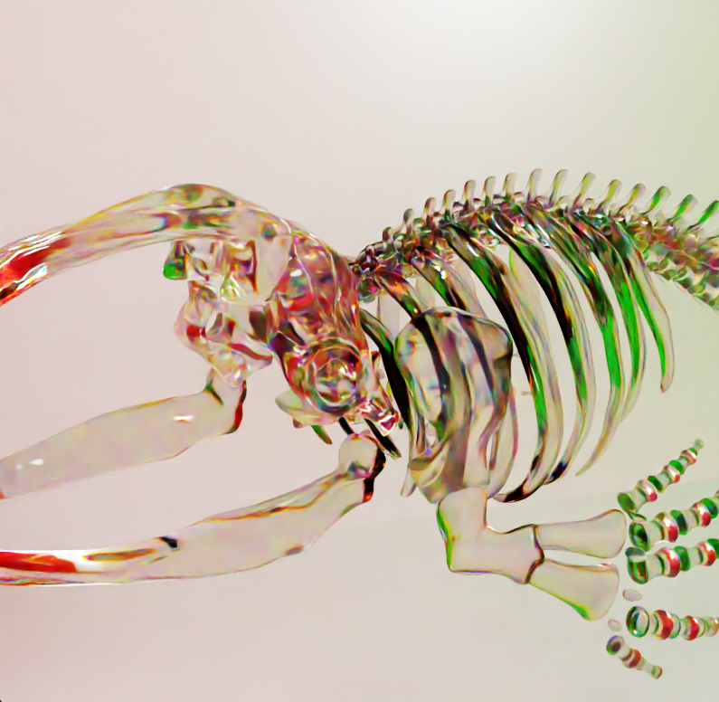
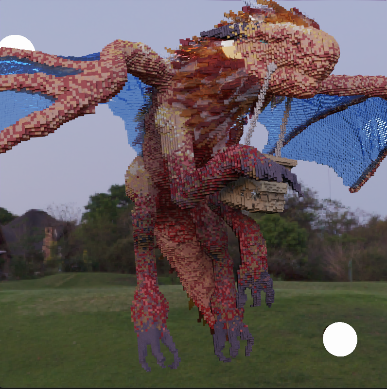

CUDA Path Tracer
==================

**University of Pennsylvania, CIS 565: GPU Programming and Architecture, Project 3**

* Aaron Jiang
  * [LinkedIn](https://www.linkedin.com/in/aaronpjiang/), [Personal Website](https://aaron-jiang.com/)
* Tested on: Windows 11, i5-13420H @ 1.99GHz 16GB, GTX 4050 16MB (Personal Computer)

## Overview

This repository contatains a Monte Carlo pathtracer implemented in C++ and CUDA and supporting Global Illumination with a variety of materials, GLTF mesh loading, all while being parallelly optimized for the GPU.

### Gallery
| Fox Den \| 824,502 Tris \| 131 Objects \| 500 spp \| 800x800|
|-|
||


| Basket \| 416,604 Tris \| 40 Objects \| 500 spp \| 800x800|
|-|
||

| Bake-Kujira \| 2,075,928 Tris \| 37 Objects \| 500 spp \| 800x800 |
|-|
||

### Features
#### Visual Features
- Diffuse and Perfect Specular BRDFs
- Refraction and Glass BRDFs
  - Faux Spectrum Refraction Glass
- Conductor (Metallic BRDF)
- GLTF Loading
  - Support for arbitrary meshes
  - Texture Loading
    - Albedo Maps
    - Normals Maps & Bump Mapping
    - Roughness and Metalness Maps
  - Camera Loading
- HDRI Environment Maps
- Thin Lens Depth of Field
- Color Correction
  - Reinhard, ACES, and Gamma Correction

#### Performance Features
- Bounding Volumne Hierarchy Acceleration Structure
- Russian Roulette
- Stream Compaction
- Material Sorting
- Intel OpenImage Denoising
- Render Checkpointing

### Pathtracing
In the field of computer graphics, we aim to compute the distribution of light around a scene. We compute the distribution by bouncing around paths of light starting from the camera. On each bounce, light is physically modeled by the Rendering Equation.

$L(p, \omega_o) = L_e(p, \omega_o) + \int_\Omega f(p, \omega_i, \omega_o)L_i(p, \omega_i)(\omega_i \cdot N) d\omega_i$

The rendering equation aims to calculate the amount of light leaving point $p$ at direction $w_o$, and is a combination of the emitted light $L_e$ at point $p$, and the integral over all incoming directions $\omega_i$ in a hemisphere around the normal vector. The terms within the intergral are the bidirectional scatttering distribution function $f$, the percentage of light transfered from $\omega_i$ to $\omega_o$ at point $p$, the incomining light $L_e$, and an absdot term to account for Lambert's cosine law.

The integral in the rendering equation has no closed-form solution, so we estimate it through Monte Carlo Sampling. For each pixel in our image, we will send multiple sample rays. On each bounce, we will randomly (though not uniformly) sample a new direction for our ray to travel in. Given enough samples, the image should converge to the mathematical truth.

### BxDFs

This pathtracer supports perfect diffuse and specular materials, as well as glass reflection and transmission using the Fresnel equation.

| Diffuse, Specular, and Glass \| 500 spp \| Denoised |
|-|
||

To fake spectrum refraction, we can also treat the RGB channels separately, filtering to one channel on transmission and assigning different IORs.

| Faux Spectrum Glass Bake-Kujira \| 500 spp \| Denoised |
|-|
||

So far, the materials we have dealt with so far are dielectric, instead of conductors. In metals and conductors, glancing light rays can excite electrons leading to additional radiation. This is responsible, for example, for metal having colored speculars. This can be approximated with a Fresnel term with a complex component. I implemented the conductor Fresnel equation found here https://cseweb.ucsd.edu/classes/sp17/cse168-a/CSE168_03_Fresnel.pdf.

| Metallic Bake-Kujira \| 500 spp \| Denoised |
|-|
||

### GLTF Loading

The Graphics Language Transmission Format (GLTF) is a versatile 3D scene file format for meshes, textures, and animations. This pathtracer supports the reading of meshes, textures, and cameras from GLTF files.

The pathtracer uses the [tinygltf](https://github.com/syoyo/tinygltf) library for help parsing .gltf and .glb files. The pathtracer records position, normal, uv, and index data, and also calculates tangent and bitangent data.

I also implemented a custom ray-triangle intersecter using the Moller-Trumbore algorithm, and smoothed the normal and uv data through barycentric interpolation.

I used CUDA's texture interface and transfered the CPU-side texture data into CUDA Texture Objects, which can then be read using the interpolated UVs during shading.

Note: There currently seems to be a bug in the normal map evaluation that leads to a strongly reduced amount of influence. 

| No Textures | Albedo | Normal | 
|-|-|-|
| | | |

| Metalness | Combined |
|-|-|
| | |

### Environment Maps
After working with textures during model loading, I also implemented loading textures for mapping the world background. Environment maps consist of a spherical light data projected equirectangularly onto a 2:1 image. This can then be reprojected into a sphere using simple trigonmetry. This images are also in high dynamic range, being floats that can be much larger than the typical 0-1 range, in order to linearly describe the amount of light coming from certain directions.

|Environment Map 1| EnvironmentMap 2|
|-|-|
| | | 

### Thin Lens Depth of Field

The simplest camera to simulate is a pinhole camera. This is able to be physically modelled in real life, with a box with a pinhole cut out in one of its faces. The light rays traveling through the pinhole will form an upside-down version of the world on the back wall of the box. If we want to introduce depth of field, instead of pointing our light rays at a pin hole, we instead aim at a fixed point on the focal plane, and jitter the spawn position of our rays.

|Focal Plane at 2.2m | Focal Plane at 3.2m |
|-|-|
|||


### Color Correction

The color space rays calculate is in linear HDR, which presents two problems. Firstly, we need to find some way to map the HDR data in the interval $[0 , \infin)$ to $[0,1]$. This path tracer has two options: the Reinhard and ACES operators. Secondly, in linear space, the numbers representing the luminosity is represented linearly. However, humans do not perceive luminosity linearly but rather we are able to distinguish darks much more than lights. This is accounted for in all computer screens by passing pixels through a gamma function that maps color to maximum contrast. Our pathtracer needs to counteract this affect, so Gamma Correction is used.

|No Correction| Reinhard| ACES|
|-|-|-|
| |  | |

|Gamma Correction| Reinhard + Gamma Correction| ACES + Gamma Correction|
|-|-|-|
| |  | |

## Performance Optimizations

All charts in the performance section comprise of tests on a closed scene, SkaylBox, as seen in the texturing section, and on an open scene, SkaylBoxless, which is identical except for the removal of the Cornell Box. Each test was done at 500 spp and 800 x 800 pixels, and charts will show the time elasped per frame, so smaller is better.

### Bounding Volume Hierarchy Acceleration Structure

Meshes have hundreds to millions of triangles. To naively calculate ray-mesh intersections, you would have to perform an intersect test for each triangle, resulting in $O(n)$ runtime. We can use an acceleration structure to partition space to lower runtime down to $O(\log n)$.

The acceleration structure I chose to implement was a Bounding Volume Hierarchy (BVH). A BVH consists of a binary tree of bounding boxes. A ray traversing a BVH can totally ignore a node and all its descendents if it does not intersect with its bounding box.

#### Building
After we load a GLTF mesh object, we assemble the triangles and calculate the bounding box of the object by iterating through all positions. We can make this representation of the whole object the root node of our BVH tree.
``` python 
Until we reach the layer limit:
  For all nodes in the current layer:
    Find the split axis and split point
    Parition triangles by the side their centroid lies of the split point
    Calculate bounding boxes of both sides and init firstSide and secondSide
    if one side is empty:
      # If the node cannot be split further, it will be a leaf
      continue
    node.leftChild <- firstSide
    node.rightChild <- secondSide
```
There are numerous ways to find a split point. The simplest among them is simply to split the largest axis at its midpoint, which was implemented in this repo.

Optimizing this split point calculation to rely on the median triangle, or testing several splits using the Surface Area Heuristic are areas of future work that would result in a more regular and more balanced BVH tree.

#### Traversal
We can traverse a BVH by keeping a stack of nodes to look at. For each node, we can detect whether we hit the leftChild, the rightChild, or both. We can then add them to the stack and this procedure will recurse until we get to leaf nodes, for which we will test all triangles inside.


Including a BVH leads to massive speedups because intersections are a major bottleneck for large scenes. We see for both closed and open scenes, including a BVH leads to 8-10x less time.

### Russian Roulette

As light paths bounce around, we update the throughput of light that path will let through due to its path traced. Some of these light paths will have very little light information. These paths are negliable, so we can terminate them while weighing surviving paths appropriately in order to not lose any expected light. This allows us to converge to the final image fast without any loss of light or visual difference.


Russian Roulette also improves runtime significantly in closed scenes. It improves performance by around 1.5 times. In open scenes, rays on average are more likely to escape and shoot out into the background, so they are less likely to reach to low threshold needed to be cut by Russian Roulette.

### Stream Compaction

What does it mean for paths to terminate? On the GPU, we will launch a thread for every path, so for that to be an improvement to performance, we need the number of threads we launch to firstly decrease, and secondly be compacted so the alive threads are continguous. This is done using stream compaction. I partition all alive paths after the intersection tests, to remove paths that shoot out of bounds or hit a light. All remaining path segments are compacted to the start of the array so that the rest of the loop can work on just the remaining bounces.


Stream Compaction also improves runtime significantly. It has a greater affect on open scenes, as open scenes have more rays escaping that can be culled. It reduced runtime by 2.4x in open scenes and 1.4x in closed scenes.

### Material Sorting

On the GPU, coherency in memory access is very important for runtime. This is because GPU reads from global memory are read in chunks, usually of 64 or 128 bytes at a time. In our shading kernel, we have to test our intersections' material_id with a large variety of materials, causing divergence in each warp. With material sorting, we aim to sort the path segments by material_id, in order to promote warp coherency.


Material Sorting unfortunately did not improve runtime. The closed scene tested had five different materials, while the open scene had less at just two. This is combined with the increased culling in the open scene to explain why the closed scene suffered a larger performance hit. My renderer doesn't use enough materials for material sorting to be worth the upfront performance cost.

### Intel OpenImage Denoising

Even with these optimizations, pathtraced images still end up noisy for a long time. This repo uses an ML denoiser to reduce the noise from the render as a post processing step.

| With Denoising | Without Denoising | 
|-|-|
|||


Denoising comes at a flat cost of around 40 ms per iteration, which is more than worth it for scenes taking a long time to converge.

### Image Checkpointing

I also implemented a way to save the renderer state mid-render, in order to resume it again at a later date. This helps prevent loss of work if the program crashes.

### Resources Used

Special thanks to the 5650 Course Staff for all your help.

Additional thanks to the 4610 Rendering Course at Penn for giving me a solid foundation in pathtracing.

This repo included third party code from STBI, tinygltf, and OIDN.

All models used are my own.

Additional Resources used include:  
The PBRT: https://www.pbr-book.org/4ed/contents  
Jbikker's BVH blog: https://jacco.ompf2.com/2022/04/13/how-to-build-a-bvh-part-1-basics/  
Sebastian Lague's videos on Raytracing, BVHs, and Specular Materials https://www.youtube.com/c/SebastianLague  


### Bloopers

|Errors in sorting cause scan lines!| Manually padding HDRIs is tricky! |
|-|-|
| | |


